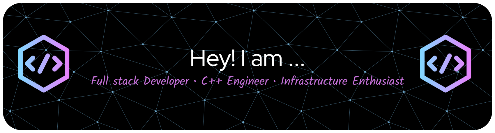

# Hi there 👋

I'm a developer who spends most of my time working on game servers, backend systems, and old C++ code that probably should have been rewritten years ago.

Currently rebuilding and modernizing legacy MMORPG infrastructure while experimenting with newer technologies along the way.

## What I'm Working On

* 🎮 Multiplayer game server development
* ⚙️ Modernizing legacy C++ projects
* 🌐 Backend services with TypeScript and Node.js
* 🐧 Linux infrastructure and DDoS protection
* 🔍 Reverse engineering game clients and protocols
* 🗄️ PostgreSQL and database architecture

## Tech I Use

### Languages

* C++
* TypeScript
* JavaScript
* SQL

### Backend

* Node.js
* Hono
* PostgreSQL
* MSSQL Server
* Kysely
* Prisma

### Infrastructure

* Linux
* Docker
* HAProxy
* iptables
* WireGuard

## Current Projects

### Axora

Internal desktop tools for managing MMORPG server infrastructure.

### Novera

Community and account platform.

> United by Purpose. Driven by Legacy.

## Things I Enjoy

* Solving weird networking issues
* Reading old game source code
* Optimizing servers
* Building developer tools
* Learning how legacy systems actually work

## Fun Fact

Most of my projects start with:

> "I'll just fix this one small thing."

And somehow end up becoming a complete rewrite.

---

## My Statistics

## Contact

* GitHub: https://github.com/vexakuro67
* Discord: vexakuro

---

*"First make it work. Then make it fast. Then figure out why it broke in production."*
